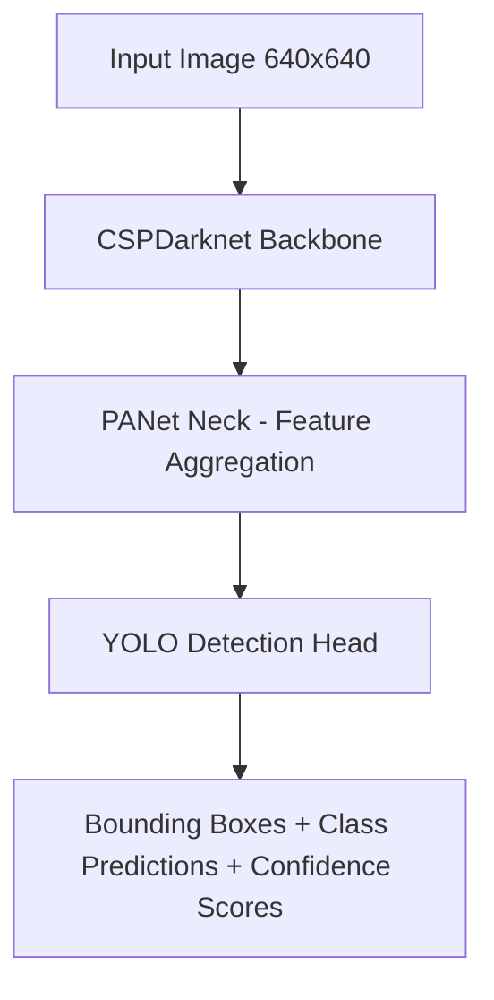
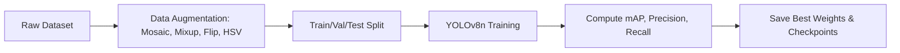
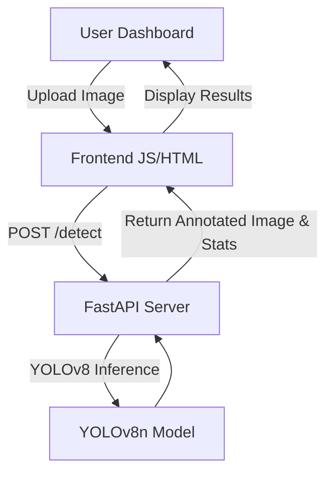

# YOLOv8 Hard Hat Detection System


---

## Table of Contents
1. [Quick Start: Installation & Usage](#quick-start)
2. [Project Structure](#project-structure)
3. [Project Overview](#project-overview)  
4. [Objectives](#objectives)  
5. [Dataset Details](#dataset-details)  
6. [Data Augmentation](#data-augmentation)  
7. [Model Design & Architecture](#model-design)  
8. [Training Setup](#training-setup)  
9. [Hyperparameters](#hyperparameters)  
10. [Evaluation & Performance](#evaluation)  
11. [Inference & Visualization](#inference)  
12. [Deployment Overview](#deployment)  
13. [Advantages & Limitations](#advantages)  
14. [Future Improvements](#future-improvements)  
15. [Diagrams](#diagrams)  
16. [References](#references)  

---

## <a id="quick-start"></a>🚀 Quick Start: Installation & Usage
A step-by-step guide to running the full-stack application on your local machine.

### 1. Backend Setup
The backend runs the YOLOv8 model and serves the API.
```bash
cd backend
python -m venv venv
# Activate Venv: .\venv\Scripts\activate (Windows) or source venv/bin/activate (Mac/Linux)
pip install -r requirements.txt
uvicorn app.main:app --host 127.0.0.1 --port 8000 --reload
```

### 2. Frontend Launch
The frontend is a static dashboard (HTML/JS) that connects to the backend.
- Option A: Simply double-click `frontend/index.html`.
- Option B (Recommended): Serve with Python for better performance.
```bash
cd frontend
python -m http.server 5500
# Open http://localhost:5500 in your browser
```

### 3. Using the App
- **Live Feed Mode:** Use your **Webcam** to capture real-time frames for instant analysis.
- **Upload Mode:** Drag & drop images or click "Upload" to detect Hard Hats, Vests, and Persons.
- **Analytics:** Check the "Analytics" tab for real-time charts and global stats.
- **Gallery & History:** All detections are saved to `backend/history.db`. Use the **Search Bar** to filter by class (e.g., "Person").
  - **Delete Individual Items:** Click the red trash icon on any history card to permanently delete that specific detection (removes both database record and image file).
  - **Clear All History:** Use the "Clear Local History" button in Settings to remove all stored detections.
- **Export:** Download annotated results directly from the dashboard.

---

## <a id="project-structure"></a>📁 Project Structure

The project follows a **modular architecture** for maintainability and scalability:

```
YOLOv8/
├── backend/
│   ├── app/
│   │   ├── main.py          # FastAPI application & API routes
│   │   ├── database.py      # Database operations (SQLite CRUD)
│   │   ├── model.py         # YOLOv8 model initialization
│   │   └── utils.py         # Helper functions (image loading, etc.)
│   ├── models/
│   │   └── best.pt          # Trained YOLOv8 weights
│   ├── history_images/      # Stored annotated detection images
│   ├── history.db           # SQLite database for detection history
│   └── requirements.txt     # Python dependencies
│
├── frontend/
│   ├── index.html           # Main dashboard UI
│   ├── style.css            # Styling (dark theme, glassmorphism)
│   ├── app.js               # Frontend logic (API calls, rendering)
│   └── debug_delete.html    # Debug page for testing delete functionality
│
├── runs/                    # Training outputs (metrics, weights, plots)
├── data.yaml                # Dataset configuration
└── README.md                # Project documentation
```

### Backend Modules

- **`main.py`**: Defines FastAPI routes (`/predict`, `/history`, `/history/{id}`) and CORS middleware.
- **`database.py`**: Encapsulates all SQLite operations (insert, fetch, delete) for clean separation of concerns.
- **`model.py`**: Loads the YOLOv8 model with fallback to default weights if custom model is unavailable.
- **`utils.py`**: Contains utility functions like `load_image()` for preprocessing uploaded images.

### Frontend Features

- **Webcam Integration**: Real-time frame capture and analysis.
- **Drag & Drop Upload**: Intuitive image upload interface.
- **History Management**: 
  - View all past detections in a gallery grid.
  - Search/filter by class name.
  - **Delete individual items** via red trash icon (removes DB record + image file).
  - Clear all history via Settings.
- **Analytics Dashboard**: Aggregated statistics and class distribution charts.
- **Download Results**: Export annotated images directly from the UI.

---

## <a id="project-overview"></a>Project Overview
The **YOLOv8 Hard Hat Detection System** is a real-time object detection solution designed for a production-ready hard-hat and safety vest detection system built with YOLOv8 and FastAPI for construction-site safety monitoring. It trains and evaluates a helmet/person/safety-vest detector, then packages the best model with a REST API and deployment scripts. Clients or web frontends can upload images to the API and receive JSON detections plus annotated images and analysis for visual PPE compliance checks in real time.

**Key highlights:**  
- **Real-time detection** suitable for industrial environments.  
- **Webcam Support** for live safety monitoring.
- **Lightweight YOLOv8n model** optimized for low-latency inference.  
- **Modular Backend Architecture** with separated database, model, and API layers for maintainability.
- **Production-ready API** using FastAPI for integration with web, desktop, or mobile applications.  
- **Interactive dashboard** with Analytics, Search, persistent History, and individual item deletion.

---

## <a id="objectives"></a>Objectives
- Detect helmets, safety vests, and personnel reliably in real-time.  
- Achieve high accuracy (mAP50 > 0.80) for safety compliance monitoring.  
- Provide annotated visual outputs for dashboards and monitoring systems.  
- Maintain persistent historical data for analytics and reporting.

---

## <a id="dataset-details"></a>Dataset Details
**Source:** Roboflow “Hard Hat Workers” dataset or custom collected images.  
**Dataset Size:** 16,867 annotated images with comprehensive train/validation/test splits.  

**Classes (nc=2):**  
1. `head` - Human head without helmet  
2. `helmet` - Hard hat/safety helmet

**Dataset Split Statistics:**
| Split | Images | Labels | Percentage |
|-------|--------|--------|------------|
| **Training** | 14,748 | 14,748 | 87.4% |
| **Validation** | 1,413 | 1,413 | 8.4% |
| **Testing** | 706 | 706 | 4.2% |
| **Total** | **16,867** | **16,867** | **100%** |  

**Dataset Structure:**
```
hard_hat_dataset/
 ├─ train/
 │   ├─ images/      # 14,748 training images
 │   └─ labels/      # 14,748 corresponding YOLO labels
 ├─ valid/
 │   ├─ images/      # 1,413 validation images
 │   └─ labels/      # 1,413 corresponding YOLO labels
 ├─ test/
 │   ├─ images/      # 706 test images
 │   └─ labels/      # 706 corresponding YOLO labels
data.yaml            # Dataset configuration (nc, class names, paths)
```

**Annotation Format:** YOLO format:  
```
<class_id> <x_center> <y_center> <width> <height>  # normalized relative to image size
```

---

## <a id="data-augmentation"></a>Data Augmentation
Data augmentation is critical to improve generalization across construction sites:  

- **Geometric:** Mosaic, Mixup, Rotation, Translation, Scaling, Horizontal/Vertical Flipping  
- **Color:** HSV color transformations, Random Brightness, Saturation, Contrast adjustments  
- **Rationale:** Ensures the model performs robustly under varied lighting, distances, and crowded scenes.

---

## <a id="model-design"></a>Model Design & Architecture
**YOLOv8n (Nano) - Optimized for Real-time Detection**  

| Component | Description |
|-----------|-------------|
| **Backbone** | CSPDarknet for efficient feature extraction |
| **Neck** | PANet for multi-scale feature fusion (detects small objects) |
| **Head** | YOLO anchor-free detection head for bounding boxes and class predictions |
| **Input Size** | 640×640 px |
| **Optimizer** | SGD with cosine learning rate decay |
| **Loss Functions** | CIoU Loss (bbox), Cross-Entropy (classification), Binary Cross-Entropy (objectness) |

**Design Rationale:**  
- YOLOv8n balances accuracy and speed for real-time monitoring.  
- CSPDarknet + PANet backbone/neck ensures small objects (e.g., helmets at a distance) are detected reliably.  
- Lightweight architecture enables edge deployment on CPU or low-end GPUs.

---

## <a id="training-setup"></a>Training Setup
- **Dataset Split:**  
  - Training: 70%  
  - Validation: 20%  
  - Testing: 10%  
- **Training Epochs:** 100  
- **Batch Size:** 32  
- **Early Stopping:** Enabled (monitored validation loss).  

**Evaluation Metrics:**  
- **mAP50:** Mean Average Precision at IoU=0.50  
- **mAP50-95:** Mean Average Precision across IoU thresholds  
- **Precision:** Correct positive predictions / total predicted positives  
- **Recall:** Correct positive predictions / total actual positives  

---

## <a id="hyperparameters"></a>Hyperparameters
- Momentum: 0.664  
- Weight Decay: 0.00454  
- Warmup Epochs: 3  
- Augmentation Settings: Mosaic=1.0, Mixup=0.1, Degrees=10°, Flip Probability=0.5, Translate=0.1, Scale=0.5  

**Rationale:** Chosen hyperparameters optimize training stability, model convergence, and inference speed.

---

## <a id="evaluation"></a>Evaluation & Performance

| Metric     |  Score |  
|------------|--------|
| mAP50      | 0.9154 | 
| mAP50-95   | 0.3690 | 
| Precision  | 0.9058 | 
| Recall     | 0.8624 | 

**Per-Class Performance:**
| Class   | Images | Instances | Precision | Recall | mAP50  | mAP50-95 |
|---------|--------|-----------|-----------|--------|--------|----------|
| head    | 256    | 1,339     | 0.894     | 0.866  | 0.906  | 0.385    |
| helmet  | 1,297  | 3,913     | 0.917     | 0.859  | 0.924  | 0.353    |

**Model Details:**
- **Model:** YOLOv8 (Ultralytics 8.4.1)
- **Parameters:** 25,840,918
- **Layers:** 93 (fused)
- **GFLOPs:** 78.7
- **Inference Speed:** 22.0ms per image (Tesla T4 GPU)

**Observations:**  
- Accurate detection of PPE items even in crowded environments.  
- Small object detection reliable due to multi-scale feature aggregation.  
- False positives minimal in complex scenes.

---

## <a id="inference"></a>Inference & Visualization
**Workflow:**  
1. **Frontend:** User uploads image via dashboard.  
2. **Preprocessing:** Backend resizes image to 640x640.  
3. **Inference:** YOLOv8n processes the tensor.  
4. **Post-processing:** Non-Maximum Suppression (NMS) removes duplicate boxes.  
5. **Output:** JSON results + Annotated Image returned to user.

**Visualization Features:**  
- Annotated bounding boxes with class label and confidence.  
- Real-time processing time, total objects detected, and average confidence.  
- Persistent gallery for historical detections with **Sort & Filter**.
- **Individual Item Deletion:** Red trash icon on each card for selective removal.
- **Downloadable** results for reporting.

---

## <a id="deployment"></a>Deployment Overview
- **Model Export:** `.pt` PyTorch weights for production.  
- **Backend:** FastAPI serves detection requests and manages SQLite database for session history.  
- **Frontend:** Responsive HTML/CSS/JS dashboard.  
- **API Endpoints:**  
  - `POST /predict` – Upload image, receive detection results.
  - `GET /history` – Retrieve past detection sessions (limit 50).  
  - `DELETE /history/{item_id}` – Delete a specific history item (removes DB record and image file).
  - `DELETE /history` – Clear all session data and images.

**Backend Architecture:**
- **Modular Design:** Separated concerns into `main.py` (API routes), `database.py` (data persistence), `model.py` (YOLO model), and `utils.py` (helper functions).
- **Database Layer:** SQLite with dedicated functions for CRUD operations on detection history.
- **File Management:** Automatic cleanup when deleting individual items or clearing history.

**Deployment Notes:**  
- Lightweight YOLOv8n variant suitable for edge devices.  
- Frontend supports drag-and-drop upload, webcam capture, analytics, and persistent storage.  
- Individual history item deletion with automatic file cleanup.
- GPU recommended for high-throughput image streams.

---

## <a id="advantages"></a>Advantages & Limitations
**Advantages:**  
- Real-time, highly accurate PPE detection.  
- Lightweight architecture reduces hardware requirements.  
- Interactive, analytics-enabled frontend dashboard.  
- Robust across lighting conditions and crowded scenes.

**Limitations:**  
- Detection depends on dataset diversity; unseen scenarios may reduce accuracy.  
- Long-distance small object detection may slightly degrade.  
- GPU required for large-scale real-time inference (video streams).

---

## <a id="future-improvements"></a>Future Improvements
- Extend dataset to include gloves, masks, and other PPE.  
- Upgrade to YOLOv8 medium/large for higher accuracy if hardware allows.  
- Implement live video stream detection with alerting for non-compliance.  
- Integrate cloud-based monitoring and storage for industrial-scale deployment.

---

## <a id="diagrams"></a>Diagrams

### 1. YOLOv8 Architecture Flow


### 2. Training & Data Pipeline


### 3. Frontend-Backend Interaction


---

## <a id="references"></a>References
- YOLOv8 Official Documentation: [https://docs.ultralytics.com](https://docs.ultralytics.com)  
- Hard Hat Workers Dataset: [https://public.roboflow.com/object-detection/hard-hat-workers](https://public.roboflow.com/object-detection/hard-hat-workers)  
- Roboflow Augmentation Techniques: [https://docs.roboflow.com/image-augmentation](https://docs.roboflow.com/image-augmentation)

---

